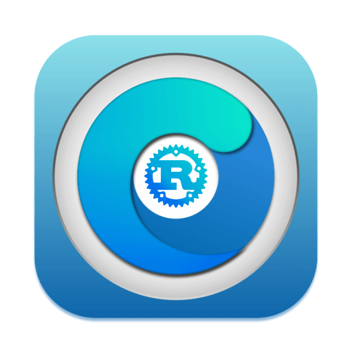

<h1>
  
  ocrecovery-rs
</h1>

ocrecovery-rs is a experimental port of [ocrecovery.py](https://github.com/ThinkDifferentInc/ocrecovery) from Python to Rust.

# why consider a rust port?

native executable, memory-safe, stream-downloads, more stability, faster execution times - overall rust is a better and a faster language.

reason why explained here - [rust to py, explanation.](https://github.com/prodbyeternal/prodbyeternal/blob/main/otherstuff/ocrs.md)

# preview

